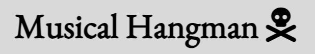
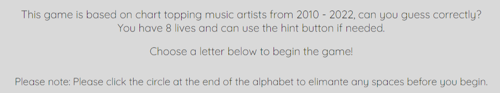
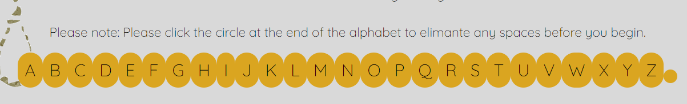
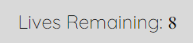
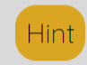

# Hangman Game 
[View the live site here](https://beccaob.github.io/hangman-pp2/)

## Final Design 

## Introduction & Table of Contents
My hangman game is based on musical artists from 2010 - 2022. The user must guess the artist in 8 lives or less. The aim of this project was to create an interactive front-end site which responds to user actions. I had started by creating a quiz but found that hangman would be a better option for me. 

### Table of contents

## User Expierence (UX)
- ### User Stories
1. As a user, I want to test my knowledge on music artists from 2010 - 2022.
2. As a user, I want to revisit a childhood game that I enjoyed. 
3. As a user, I want to know what letters I have already guessed. 
4. As a user, I want to see how many lives I have left. 
5. As a user, I want to be able to restart the game.
6. As a user, I want to have access to a hint. 

- ### Design 
    - ### Colour Scheme 
    I used a grey/black/yellow/white colour scheme as I believe the colours go well together and do not cause any contract errors. 
    1. Black was used for main text.
    2. Yellow was used for the alphabet background color. 
    3. Grey was used for the overall background color. 
    4. Black was used for hover background and white was used for hover text, this allowed the user to confirm that they were hovering over the buttons. 
    5. Grey was also used for the letters that the user had previously guessed. This let the user know that the letter had been guessed and they could not use it again. 

    - ### Fonts
    For the fonts, I used 'EB Garamond' for headings & 'Quicksand' for regular text, both from Google Fonts. I used 'sans-serif' as a backup should those fonts not be available for all.

    - ### Icons 
    The icon used in the Heading was obtained from Font Awesome. 

    - ### Images
    The background image was made on Canva Pro. 

### Wireframes
I used wireframes to give myself a general idea of what I wanted the site to look like.
[home-page](assets/images/readme-img/home-page-wf.png)
[404-error](assets/images/readme-img/404-wf.png)

## Features
 - ### Heading
 Contains title of the game. 
 
 - ### Description
 Contains information on what the game is about and how to play.
 
 - ### Alphabet
 Contains the alphabet needed to play the game. The letters are changed from yellow to grey when the user selects them. This allows the user to keep track of what letters they have previosuly guessed. The letters are reset to the default colour when the user restarts the game. There is a little circle at the end of the alphabet which is a space. I have added an instruction for the user to click this circle before they begin the game as a tempory fix. This is an unfixed bug which is mentioned in the unfixed bug section. 
 
 - ### Lives Counter 
 This allows the user to see how many lives they have left. If they choose an incorrect letter, the lives will decrease by 1. If the lives counter reaches zero - the user is informed that they have lost the game. 
 
 - ### Hint Button 
 This button will display a hint for the user to find the correct answer. The hint will remain visable until the user has finished the game. When the game is reset - the hint will be hidden until the user requests it again. The background colour will change to black and the text to white if this button is hovered over so the user knows they can click it. 
 
 
 - ### Restart
 This button will allow the user to restart the game at any time. The background colour will change to black and the text to white if this button is hovered over so the user knows they can click it. 
 
 