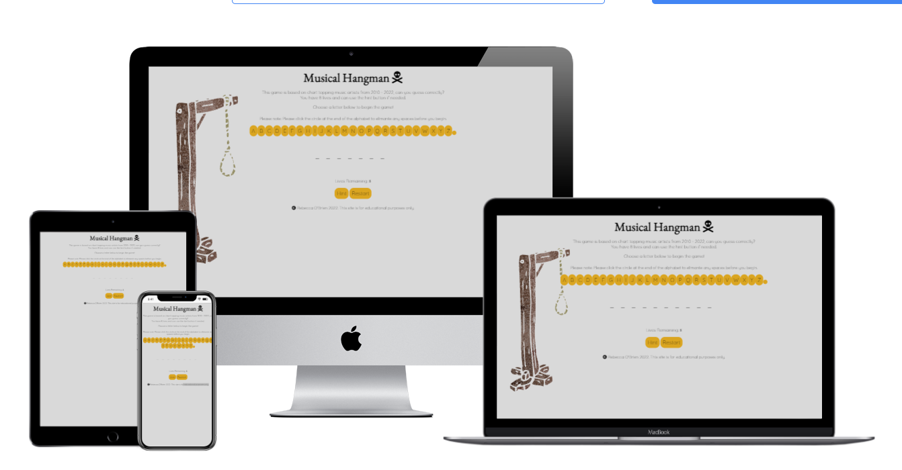
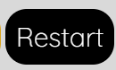

# Hangman Game 
[View the live site here](https://beccaob.github.io/hangman-pp2/)

## Final Design 

## Introduction & Table of Contents
My hangman game is based on musical artists from 2010 - 2022. The user must guess the artist in 8 lives or less. The aim of this project was to create an interactive front-end site which responds to user actions. 

### Table of contents

## User Expierence (UX)
- ### User Stories
1. As a user, I want to test my knowledge on music artists from 2010 - 2022.
2. As a user, I want to revisit a childhood game that I enjoyed. 
3. As a user, I want to know what letters I have already guessed. 
4. As a user, I want to see how many lives I have left. 
5. As a user, I want to be able to restart the game.
6. As a user, I want to have access to a hint. 

- ### Design 
    - ### Colour Scheme 
    I used a grey/black/yellow/white colour scheme as I believe the colours go well together and do not cause any contract errors. 
    1. Black was used for main text.
    2. Yellow was used for the alphabet background color. 
    3. Grey was used for the overall background color. 
    4. Black was used for hover background and white was used for hover text, this allowed the user to confirm that they were hovering over the buttons. 
    5. Grey was also used for the letters that the user had previously guessed. This let the user know that the letter had been guessed and they could not use it again. 

    - ### Fonts
    For the fonts, I used 'EB Garamond' for headings & 'Quicksand' for regular text, both from Google Fonts. I used 'sans-serif' as a backup should those fonts not be available for all.

    - ### Icons 
    The icon used in the Heading was obtained from Font Awesome. 

    - ### Images
    The background image was made on Canva Pro. 

### Wireframes
I used wireframes to give myself a general idea of what I wanted the site to look like.

[home-page](assets/images/readme-img/home-page-wf.png)

[404-error](assets/images/readme-img/404-wf.png)

## Features
 - ### Heading
 Contains title of the game. 

 

 - ### Description
 Contains information on what the game is about and how to play.

 

 - ### Alphabet
 Contains the alphabet needed to play the game. The letters are changed from yellow to grey when the user selects them. This allows the user to keep track of what letters they have previosuly guessed. The letters are reset to the default colour when the user restarts the game. There is a little circle at the end of the alphabet which is a space. I have added an instruction for the user to click this circle before they begin the game as a tempory fix. This is an unfixed bug which is mentioned in the unfixed bug section. 

 

 - ### Lives Counter 
 This allows the user to see how many lives they have left. If they choose an incorrect letter, the lives will decrease by 1. If the lives counter reaches zero - the user is informed that they have lost the game. 

 

 - ### Hint Button 
 This button will display a hint for the user to find the correct answer. The hint will remain visable until the user has finished the game. When the game is reset - the hint will be hidden until the user requests it again. The background colour will change to black and the text to white if this button is hovered over so the user knows they can click it. 

 
 

 - ### Restart
 This button will allow the user to restart the game at any time. The background colour will change to black and the text to white if this button is hovered over so the user knows they can click it. 

 
 

 - ### Game Won 
 If the user wins the game, they will be shown a congradulations message with the correct answer shown underneath. They will then be told how to restart the game. 

 

 - ### Game Lost 
 If the user loses the game, they will be shown an apology message with the correct answer shown underneath. They will then be told how to restart the game. 

 

 ## Technologies used
 ### Languages
 1. HTML
 2. CSS
 3. JavaScript

 ### Programs
1. Balsamiq 
Balsamiq was used to create my wireframes. 
2. Git 
Used for version control, commits and pushing to Github. 
3. Github
Used for storing my repository, files and images pushed from gitpod. 
4. Gitpod
IDE used. 
5. Chrome Developer Tools 
Used for troubleshooting when needed. Also used to check responsiveness. 
6. Google Fonts
Used for site fonts. 
7. Font Awesome 
used for icons. 
8. Canva Pro
Used to create the background image. 
9. Favicon.io 
Favicon files were created using https://favicon.io

## Testing 
The W3C Markup Validator, W3C CSS Validator Services and jshint.com were used to validate my project. 

JS Hint stated that i have one undefined variable. This is from the below lines of code: 

### Lighthouse 

### Wave 
Testing was targeted towards ensuring the following criteria was met: 
* Color contrasts meet the minimum requirements specified in WCAG Contrast Guidelines. 
* All content is contained within landmarks to allow the user to navigate by page region.
* Heading levels are not skipped or missed. This will ensure the importance of content is conveyed to the user.  
* HTML page language has been set. 

### Devices 
All pages were tested to ensure responsiveness on screen sizes from 320px upwards. Each page was tested on Chrome, Edge and Firefox. 

Steps to test: 
1. Open the browser and navigate to [Hangman Game](https://beccaob.github.io/hangman-pp2/index.html)
2. Open the developer tools ( right click & inspect )
3. Set to responsive & decrease width to 320px
4. Set the zoom to 50%
5. Click & drag window to max width

Expected Outcome: 
* Responsive on all screen sizes, no pixelated/stretched images
* No horizontal scroll bar
* No element overflow

Actual Outcome: 

The website behaved as expected across all tests. 

The site was also tested on the following devices and no issues were detected: 

* Apple IPhone 13 
* One Plus 7T 
* Samsung A32
* Asus 15.6" M509DA-EJ034T   
* HP Pro Desk 400 G6 SFF

## Unfixed Bugs 
As mentioned eariler, below are my unfixed bugs. 
1. There is a little circle at the end of the alphabet which is a space. I have added an instruction for the user to click this circle before they begin the game as a tempory fix. This is an unfixed bug which I did not have time to troubleshoot. 

## Future Features 
1. Add username feature
2. Add levels
3. Add hangman graphic
4. add levels leaderboard

# **Deployment**

The website was created using Visual Studio Code editor and pushed to the github remote repository 'the-rhythm-lounge-pp1'
The following git commands were used throughout development to push code to the remote repository: 

* git add . 
    * This command was used to add a change in the working directory to the staging area. 

* git commit -m "commit message"
    * This command was used to commit changes to the local repo queue ready to be pushed to the remote repo. 

* git push
    * This command was used to push all committed code to the remote repo on github. 

### Deployment to Github Pages

The site was deployed to Github Pages. Steps used are as follows: 
1. In the repo, open the settings tab
2. In left menu, click 'Pages'
3. From the source section, select 'Branch:main' from the dropdown menu
4. Click 'Save'
5. A live link will be displayed in green banner when published successfully

### Clone Repo Code Locally 

Navigate to the github repo you want to clone for local use

1. Click the 'Code' drop down menu
2. Click on 'HTTPS' 
3. Copy the repo link to the keyboard 
4. Open preferred integrated development environment (IDE) 

(Git must be installed for the final step) 

5. Type git clone copied-git-url into the IDE terminal

The project will now be cloned on your local machine.

### Forking the repository
1. Log into the Github repository.
2. Underneath your avatar is a button labelled **Fork**, click this.
3. You should have your own copy now.

## Credits 
1. Code Institute course material
2. JS Cheatsheet [js cheatsheet](https://htmlcheatsheet.com/js/)

### Acknowledgements
1. Slack Community for continued support. 
2. Stryker programming team for their tips, tricks and support throughout this project. 
3. My family for their patience, support and understanding. 
4. Myself for perserviering through several project idea changes, long days, nights and several instances of imposter syndrome. 

